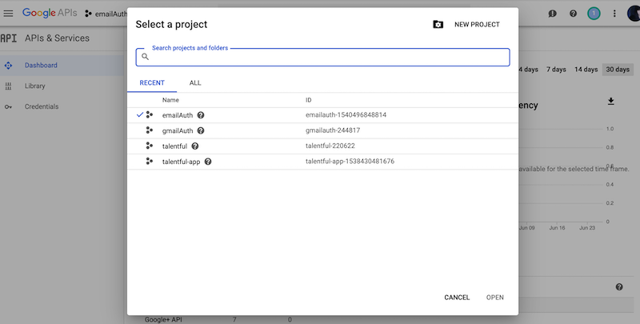
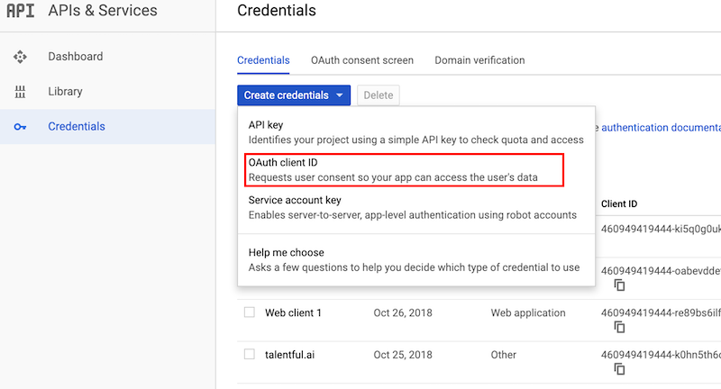
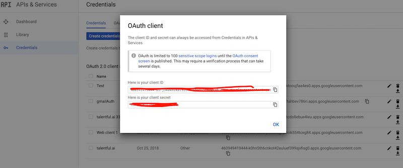
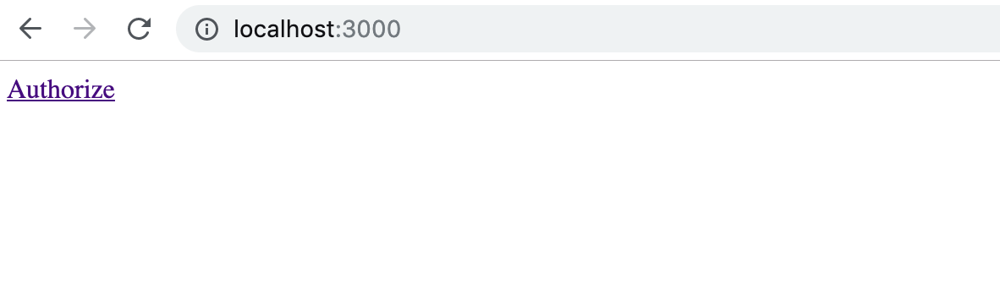
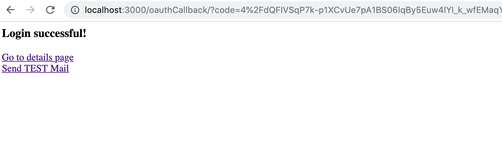
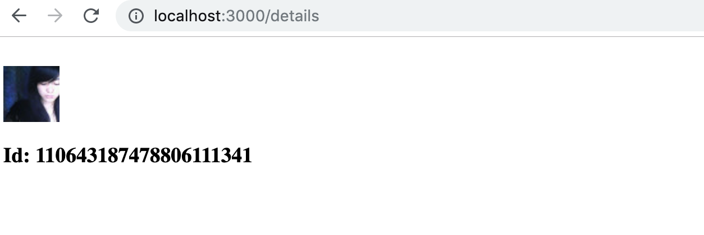

# 用Nodejs实现OAuth2授权

## 从Google中拿到Client ID和Client Serect。

- 从[Google developers console](https://console.developers.google.com/apis/dashboard)中得到Client ID和Client Serect. 第一步需要到Google developers console中创建一个项目。如下图：
 

- 新建的项目下新建Credentials,选择OAuth Client ID。然后再选择web application，填写上web application name 和 Authrized Redirected URL(callback url)。如下图：
 
- 填上所有的信息，保存之后就可以得到Client ID和Client Secret，如下：



## 调用Google的OAuth API实现身份的认证，然后授权拿到用户信息

### 项目使用Nodejs和Handlebar

- Coding准备工作，安装基本库

    `npm install express googleapis --save`

- 创建入口文件main.js,代码如下：
```javascript
        const path = require('path');
        const express = require('express');
        const app = express();
        const exphbs = require('express-handlebars');
        const Session = require('express-session');

        // require my own modules
        var detail = require('./routes/detail');
        var oauthClient = require('./routes/oauthClient');

        // init express session
        // all own modules share the session id
        // BUT need keep init express session area before app.use
        app.use(Session({
            secret: 'june-resource-secret-19890913007',
            resave: true,
            saveUninitialized: true
        }));

        app.engine('.hbs', exphbs({
            defaultLayout: 'main',
            extname: '.hbs',
            layoutsDir: path.join(__dirname, 'views')
        }))
        app.set('view engine', '.hbs')
        app.set('views', path.join(__dirname, 'views'));


        app.use('/details', detail);
        app.use('/mailSending', mailSending);

        app.get('/', (request, response) => {

            response.render('main', {
                authUrl: oauthClient.getAuthUrl()
            });

        });

        app.listen(3000, (err) => {

            if (err) {
                return console.log('something bad happened', err)
            }

            console.log('server is listening on 3000');
        })

        app.use((err, request, response, next) => {
            // log the error, for now just console.log
            console.log(err)
            response.status(500).send('Something broke!')
        });

        module.exports = app;
```

- 创建router(oauthClient.js)生成OAuth Url
    
    ```
        
        const express = require('express');
        const router = express.Router();

        // extract the google property directly be using ES6 destructuring which fixed this issue and all the further issues which were created by it.
        const { google } = require('googleapis');
        const OAuth2 = google.auth.OAuth2;

        const nodemailer = require('nodemailer');

        const ClientId = "460949419444-ki5q0g0uk464kki3lribftahbev786ri.apps.googleusercontent.com";
        const ClientSecret = "CuAqxw4ifAWXkk5znc5iJb1J";
        const RedirectionUrl = "http://localhost:3000/oauthCallback/";

        var oauthClient = {
            getAuthUrl: function() {
                var oauth2Client = this.getOAuthClient();
                // generate a url that asks permissions for Google+ and Google Calendar scopes
                var scopes = [
                    'https://www.googleapis.com/auth/plus.me',
                    'https://mail.google.com/'
                ];

            var url = oauth2Client.generateAuthUrl({
                access_type: 'offline',
                scope: scopes, // If you only need one scope you can pass it as string
                // approval_prompt: "force"
                // refresh_token will return only first time
                // set prompt to 'select_account', means user need to grant access to me each time
                // in true production, we should save refresh_token into database
                // once the access_token is expired, we could get new token obj(access_token) by refresh_token from oauth server
                prompt: 'select_account'
            });

            return url;
        },

        getOAuthClient: function() {

            return new OAuth2(ClientId, ClientSecret, RedirectionUrl);

        },

        getSmtpTransport: function() {

            return nodemailer.createTransport({
                host: 'smtp.gmail.com',
                port: 465,
                secure: true,

                auth: {
                    type: 'OAuth2',
                    clientId: ClientId,
                    clientSecret: ClientSecret
                }
            });
        }
    }
    module.exports = oauthClient;
    ```
    - 现在打个浏览器访问这个链接：
    

    - 增加callback路由
     > 在google开发者平台申请clientId时，同时申请了一个callback地址，接下来在node应用中增加这个路由。
     ```javascript
        app.get("/oauthCallback", (req, res) => {
            // get auth code from url
            var code = req.query.code,
            session = req.session,
            // get tokens (access_token and refresh_token...) from oauth server by auth code
            oauth2Client = oauthClient.getOAuthClient();

            if(!code) {

                res.send('Can not get auth code from oauth server');

                return
            }

            oauth2Client.getToken(code, (err, tokens) => {
                if (!err) {
                    oauth2Client.setCredentials(tokens);
                    session["tokens"] = tokens;
                    res.send('<h3>Login successful!</h3><a href="/details">Go to details page</a></br><a href="/mailSending">Send TEST Mail</a>');
                } else {
                    res.send('<h3>Login failed!!</h3>');
                }
            });

        });
     ```
    > google服务会跳转到这个地址，同时附上授权码code在这个地址的后面，通过这个code可以向google服务申请令牌（access token）,获取令牌后存储在当前用户的session中。
    
    - 登录成功后会重定向到下面的页面
     

    - 增加details路由，获取用户数据
    > 登录成功后接下就可以调用gogle apis来获取用户的信息。如下代码中增加details路由
    ```
    const express = require('express');
const router = express.Router();
// extract the google property directly be using ES6 destructuring which fixed this issue and all the further issues which were created by it.
const { google } = require('googleapis');
const plus = google.plus('v1');

var oauthClient = require('./oauthClient');

router.get("/", function(req, res) {

    console.log('entering to detail page');

    var oauth2Client = oauthClient.getOAuthClient();
    oauth2Client.setCredentials(req.session["tokens"]);

    new Promise(function(resolve, reject) {
        // https://developers.google.com/+/web/api/rest/latest/people/get
        // me 
        plus.people.get({ userId: 'me', auth: oauth2Client }, function(err, response) {
            if (!err) {
                resolve(response.data)
            } else {
                reject(err)
            }
        });
    }).then(function(data) {
        res.send('<h3>Id ${data.id}</h3><h3>Hello ${data.displayName}</h3><h3>profile url ${data.url}</h3>');
    }).catch(function(err) {
        res.send('message get failed!');
    })
});

module.exports = router;
    ```
> 使用存储在session中的令牌，请求接口获取用户信息。页面如下：
 

>start server using node: 
DEBUG=express* node --inspect main.js
参看链接：
https://www.cnblogs.com/phen/p/9325353.html
https://www.jianshu.com/p/8d712614a170
https://www.oauth.com/oauth2-servers/making-authenticated-requests/refreshing-an-access-token/